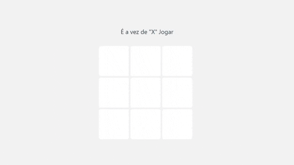

# Tic-tac-toe

The old game (or Game of the Rooster, or Tic Tac Toe) is an ancient game that helps to stimulate some aspect of children's development.

In the basic game mode, two people participate, who play alternately, filling each of the empty spaces. Each participant must wear a symbol (X or O). The player who manages to first form a line with three identical symbols, either horizontally, vertically or diagonally, wins.

    

## Technologies Used

    
    
    
    

 

- bundling tool: [Vitejs](https://vitejs.dev/guide/why.html)
- package manager: [NPM](https://www.npmjs.com/)

## Create Project:
### Yarn:
> yarn create vite project --template react-ts pro

### NPM:
> npm init vite@latest app --template react-ts

## Run project
### NPM:
> npm run dev

### Yarn:
> yarn run
